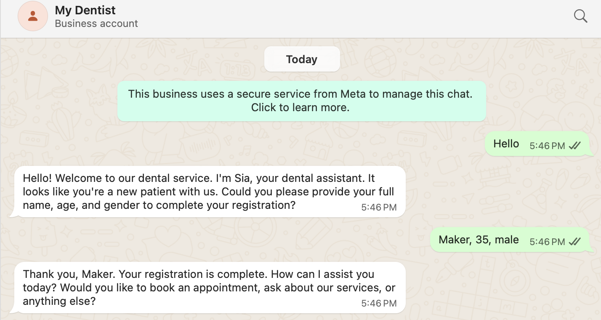
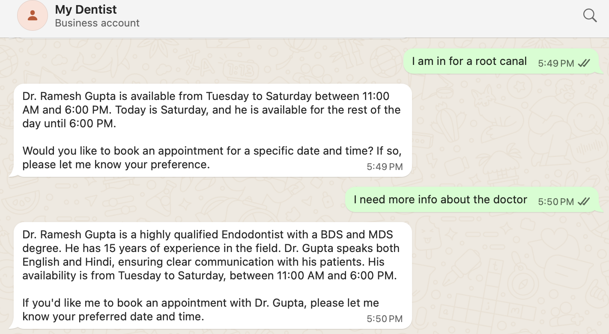
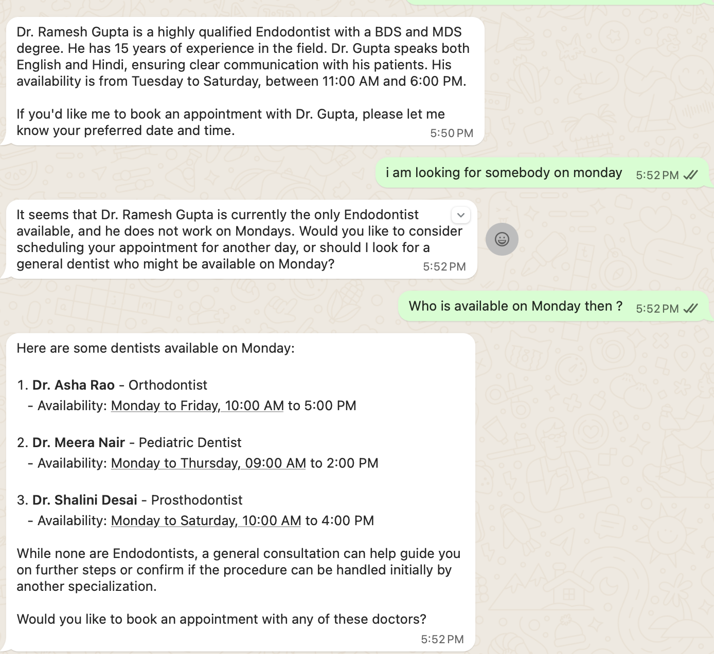
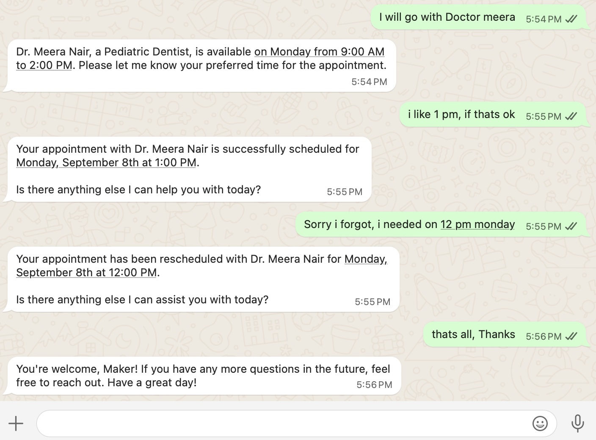
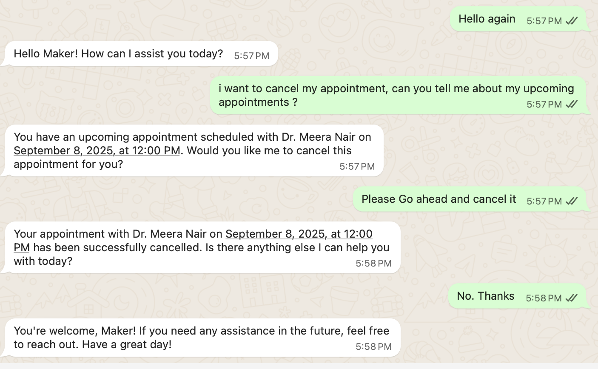

# DentalDesk 🦷

A conversational AI assistant for dental practices, powered by LangGraph and WhatsApp.

DentalDesk is an open-source project designed to automate patient communication for dental clinics. It provides a WhatsApp-based chatbot that can handle appointment scheduling, new patient registration, and answer frequently asked questions, freeing up staff to focus on providing excellent patient care.

## ✨ Key Features

- **WhatsApp-Based Interface**: Meets patients where they are, providing a convenient and familiar communication channel.
- **Appointment Management**: Allows patients to book, reschedule, and cancel appointments conversationally.
- **New Patient Registration**: Gathers essential information (name, age, gender) from new patients to streamline their first visit.
- **Conversational AI**: Built with LangChain and LangGraph for robust, stateful, and intelligent conversations.
- **Persistent Memory**: Remembers conversation history across restarts, ensuring a seamless user experience.
- **Extensible Architecture**: Uses the Machine-to-Machine Communication Protocol (MCP) to cleanly separate the agent's logic from the clinic's tools and data, making it easy to add new capabilities.

## 💬 Showcase

Here are screenshots of a complete conversation, from registration to enquiring, booking, rescheduling, and finally cancelling an appointment.

<table>
  <tr>
    <td></td>
    <td></td>
    <td></td>
    <td></td>
    <td></td>
  </tr>
</table>

## ⚙️ How It Works

DentalDesk has a decoupled architecture that makes it robust and easy to maintain.

1.  **The Agent (`src/app`)**: This is the core of the application. It uses a LangGraph `StateGraph` to manage the flow of conversation, decide when to call tools, and formulate responses. It maintains the conversation state and interacts with the message queue.

2.  **The MCP Server (`src/dentaldesk_mcp`)**: This server acts as the "backend for the AI." It exposes the clinic's business logic and data as a set of tools and prompts that the agent can use. For example, it provides tools like `book_appointment` and `list_dentists` and serves the base system prompt.

3.  **The Shared Library (`src/shared`)**: Contains the database models (Pydantic) and access functions used by both the Agent and the MCP Server, ensuring consistency.

**Conversation Flow:**

`WhatsApp Message` -> `Webhook` -> `enqueue_message()` -> `consume_messages()` -> `Agent Logic (LangGraph)` -> `MCP Server (Tools)` -> `Database`

## 🚀 Getting Started

Follow these instructions to get a local copy of DentalDesk up and running.

### Prerequisites

- Python 3.13+
- [uv](https://github.com/astral-sh/uv) (for environment and package management)
- An OpenAI API Key
- WhatsApp Business Account and API credentials

### Installation

1.  **Clone the repository:**
    ```sh
    git clone git@github.com:oxi-p/DentalDesk.git
    cd DentalDesk
    ```

2.  **Install dependencies and sync the environment:**
    `uv` will automatically create a virtual environment and install all dependencies from the `uv.lock` file.
    ```sh
    uv sync
    ```

3.  **Configure your environment:**
    - Copy the example environment file:
      ```sh
      cp example.env .env
      ```
    - Edit the `.env` file to add your `OPENAI_API_KEY` and any other required credentials (like WhatsApp API tokens).

### Running the Application

Use the `run` command in `uv` to start the application. This will start the main agent, which in turn launches the MCP server as a subprocess.

```sh
uv run server
```

### Verifying the Setup

The repository includes a simple client script to test the MCP server independently. This is a great way to confirm that the server is working and the tools are correctly exposed.

From the project root, run the following command:
```sh
uv run src/app/mcp_client.py
```

You should see a list of the available tools followed by a JSON list of the default dentists seeded in the database.

## Advanced Usage

### Running the MCP Server Standalone

The MCP server (`dentaldesk-mcp`) can be run as a standalone process. This is useful for development or for integrating the dental tools with other systems, such as the Gemini CLI.

To run the server by itself:
```sh
uv run dentaldesk-mcp
```

Below is an example of how you could configure a tool in Gemini CLI to use this standalone server:

```json
"dentaldesk-mcp": {
  "command": "uv",
  "args": [
    "run",
    "dentaldesk-mcp"
  ],
  "transport": "stdio",
  "cwd": "<path-to-your-project-folder>",
  "env": {
    "PYTHONUNBUFFERED": "1"
  }
}
```

## Project Structure

```
.
├── data/                 # Contains the SQLite database files.
│   └── dentaldesk_app.db
├── src/
│   ├── app/              # The core agent application.
│   │   ├── agent.py      # Graph creation and state management.
│   │   └── main.py       # Main entry point, message queue, and consumer.
│   ├── dentaldesk_mcp/      # The MCP server providing tools and prompts.
│   │   └── server.py
│   └── shared/           # Shared code, primarily for database interaction.
│       ├── db.py
│       └── models.py
├── .env                  # Your local environment variables (ignored by git).
├── example.env           # An example environment file.
├── pyproject.toml        # Project dependencies and scripts.
└── README.md             # This file.
```

## 🤝 Contributing

Contributions are welcome! If you have a feature request, bug report, or want to contribute code, please feel free to open an issue or submit a pull request.

1.  Fork the Project
2.  Create your Feature Branch (`git checkout -b feature/AmazingFeature`)
3.  Commit your Changes (`git commit -m 'Add some AmazingFeature'`)
4.  Push to the Branch (`git push origin feature/AmazingFeature`)
5.  Open a Pull Request

## 📄 License

This project is licensed under the MIT License. See the `LICENSE.txt` file for details.